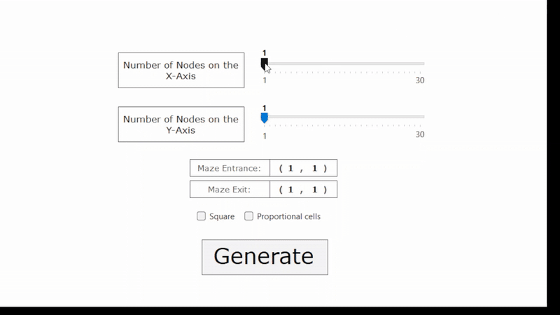
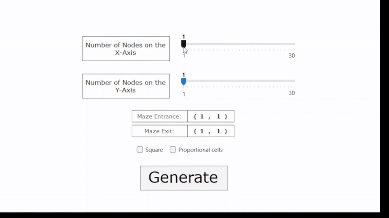
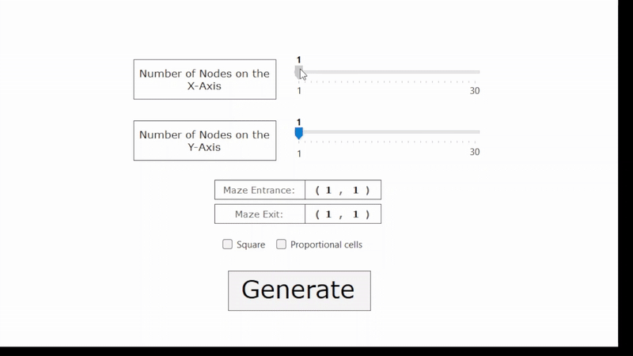
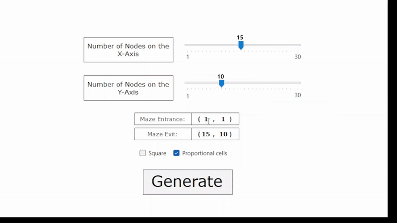
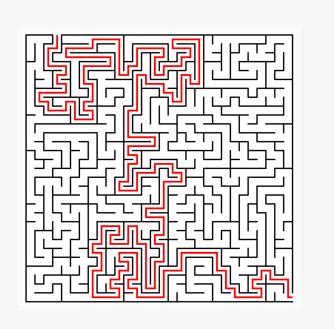
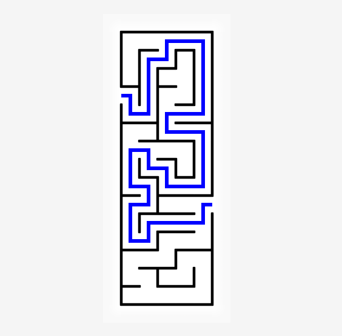
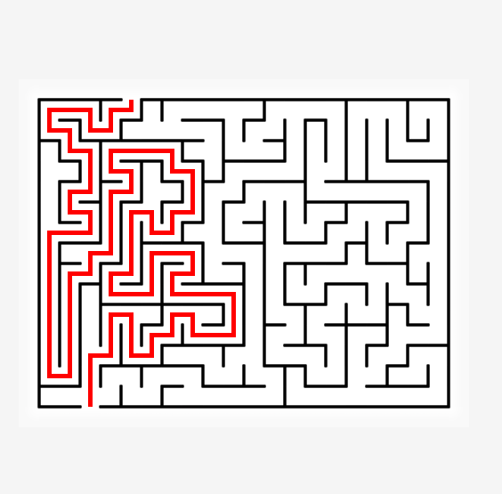

<h1>🌀 Maze Generator & Solver</h1>

A C# desktop application that generates random mazes of any width and height, allowing users to visualize and compare solving algorithms such as Dijkstra’s Algorithm and Depth-First Search (DFS) in real time.

<h2>Features</h2>

<ul>
<li>Custom Maze Generation - Create mazes of any user-defined size with random or reproducible seeds.</li>
<li>Algorithm Comparison - Solve mazes using Dijkstra’s Algorithm or Depth-First Search, and compare their execution speeds.</li>
<li>Interactive Visualization - Real-time rendering of the generation and solving process.</li>
<li>User Controls - Adjust maze dimensions, entrance and exit positions, and other parameters independently.</li>
<li>Performance Metrics - Displays time taken and nodes visited by each algorithm for benchmarking.</li>
</ul>

<h2>🎥 Demo</h2>

30x30 Maze - Solving with DFS (Left Hand Rule)

	
10x10 Maze - Solving with DFS and Dijkstra

<h4 align="center">Rectangular Mazes | Maze Entrance and Exit</h4>

  
  

	<h4 align="center">Maze Variations</h4>
  
  
  
  

<h2>⚙️ How It Works</h2>

The user specifies maze dimensions and clicks generate.

The program generates a grid of nodes with randomized paths using recursive backtracking.

The user can then choose which algorithms to solve with and compare which is quciker at finding a path from start to finish.

The visualization updates in real time for both generating and solving, allowing the user to see how the different algorithms work.

The user can also choose to export the maze saving it as a png.

<h2>Technologies Used</h2>

Built with C# (.NET 8, WinForms)

Algorithms: Dijkstra’s Algorithm, Depth-First Search (DFS)

<h2>🖥️ Usage</h2>

Clone the repository:

<pre><code>git clone https://github.com/Aaron-Antal-Bento/maze-generator.git</code></pre>

Then either:

<ul>
<li>Open the solution in Visual Studio. Build and run the project.</li>
<li>Or navigate to "Maze Generator\bin\Debug\net8.0-windows7.0\Maze Generator.exe" and run from there</li>
</ul>
